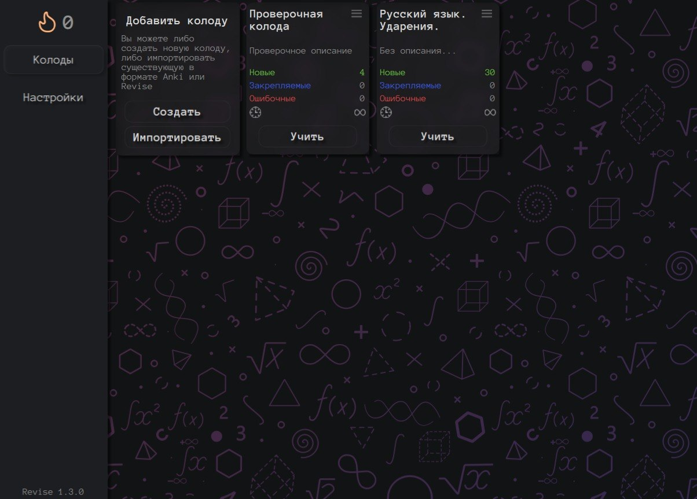
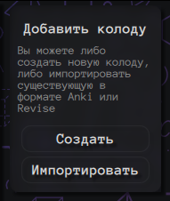
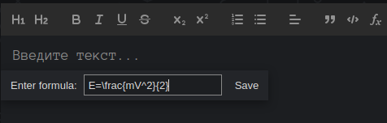
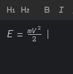

# Руководство по использованию 

## Импорт / экспорт

Revise поддерживает **импорт** в следующих форматах:

 1. `apkg` - формат колод Anki. Поддерживается частично. Импорт колод и изображений работает
 2. `rpkg` - собственный формат Revise. Он похож на Revise. Также поддерживается импорт изображений

**Экспорт** происходит только в формате Revise. В формат Anki экспортировать нельзя. 
Импорт производится с помощью первой специальной колоды в списке колод

## Настройки алгоритма обучения

Алгоритм обучения можно настроить на странице с настройками. Доступны следующие опции:

 1. `Максимальный интервал` - алгоритм обучения не сможет откладывать карточку дольше, чем на этот лимит
 2. `Скорость обучения` - чем выше значение, тем сильнее ответы пользователя влияют на сложность карточки, от которой зависит интервал ее повторения

## Создание колоды

Вы можете создать колоду используя это меню:

Нажав на кнопку "Создать", вы окажетесь на экране создания новой колоды

## Создание карточки

Чтобы создать карточку, перейдите в меню редактирования колоды и нажмите "Добавить" сверху списка с карточками

## Использование LaTeX для математических формул в карточках

LaTeX полностью поддерживается редактором карточек. Вы можете вставить формулу через специальное меню. 

После нажатия "Save" формула вставится:

